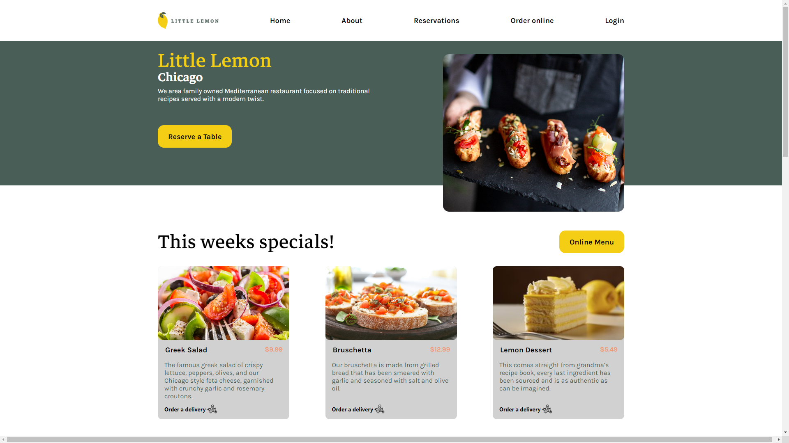

# Meta Certification Capstone
### Required capstone project for the Meta Front-End Developer Certificate

The repository was made to display the entire front-end development process required to creating a website for an imaginary restaurant called Little Lemon.  It includes wireframes and prototypes from the planning phase and code in HTML, CSS, and React.js for the actual website.  The website is comprised of the home page, booking page, and a confirmation page after a reservation has been set.



## Installation Instructions

Follow these intructions to browse the Little Lemon Restaurant website.

### Prerequisites

Make sure you have the following installed on your system:
* [Git Bash](https://git-scm.com/downloads)
* [Node.js](https://nodejs.org/en/download/)
* [npm](https://docs.npmjs.com/downloading-and-installing-node-js-and-npm)

  ### Cloning the Repository

1. Open Git Bash
2. Navigate to the directory where the project will be installed
```
cd C:\Your\Specific\Directory
```
3. Clone the repository
```
git clone https://github.com/JohnN05/meta-certification-capstone.git
```

### Build and view the website

1. Navigate to the project directory
```
cd C:\Your\Specific\Directory\meta-certification-capstone
```
2. Build the project using npm
```
npm install
```
3. Start the website
```
npm start
```

## Authors

[JohnN05](https://github.com/JohnN05) - Developer
